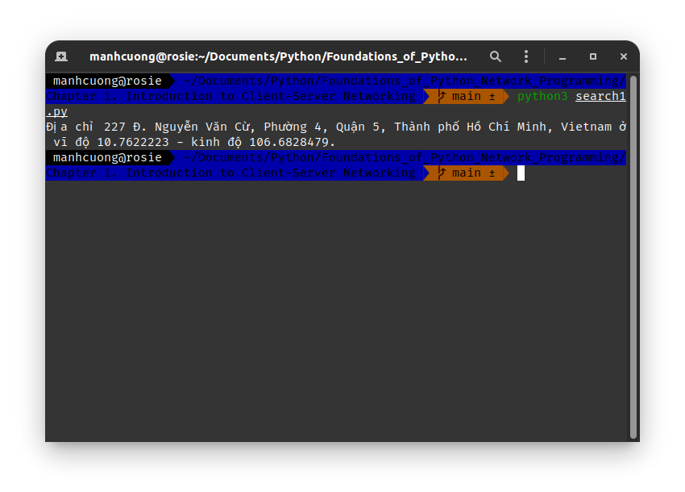
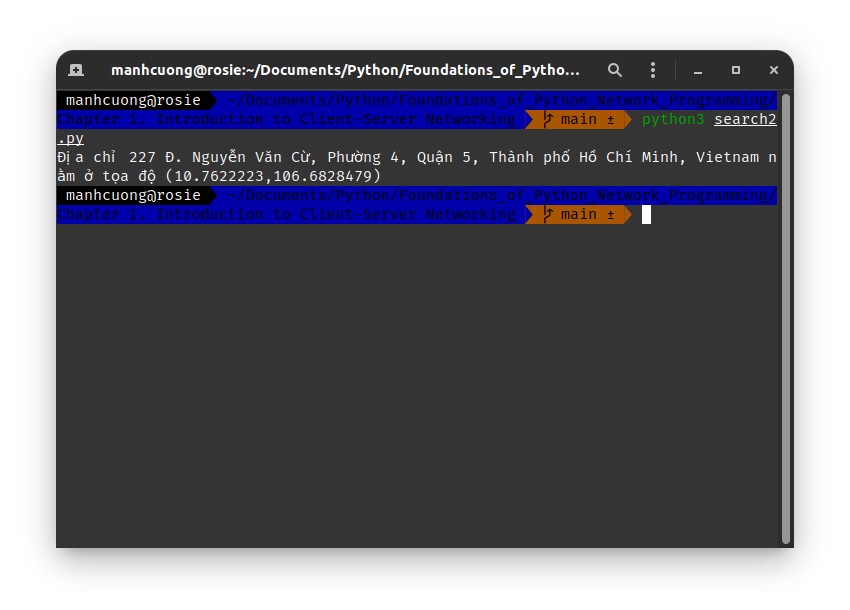
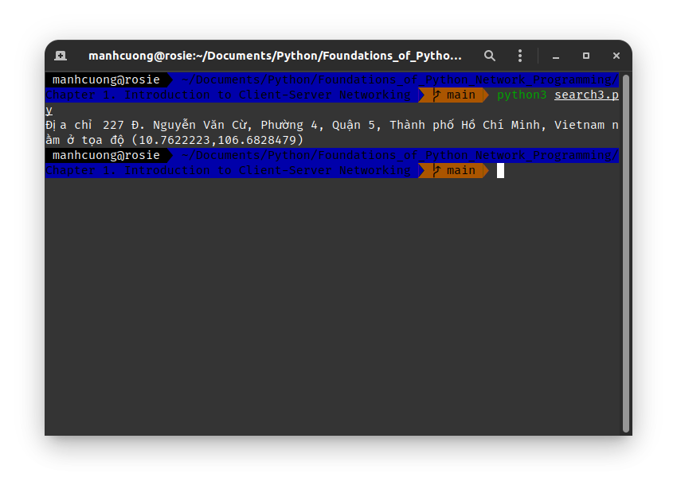
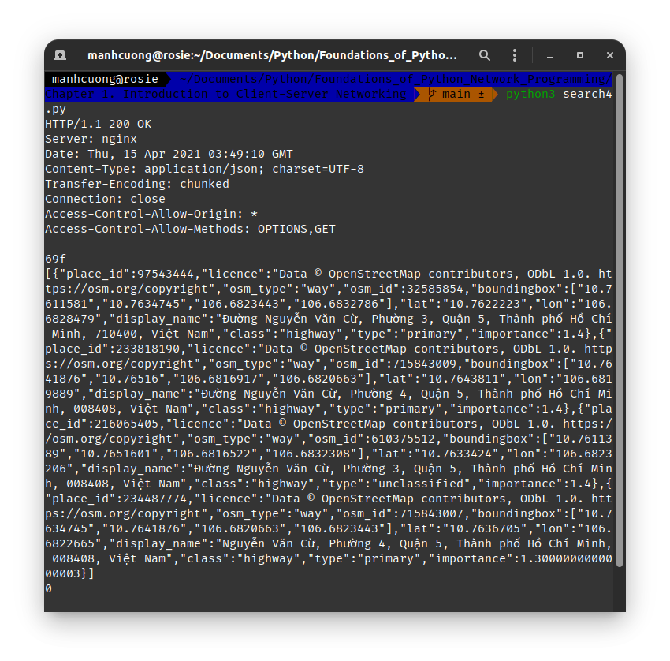
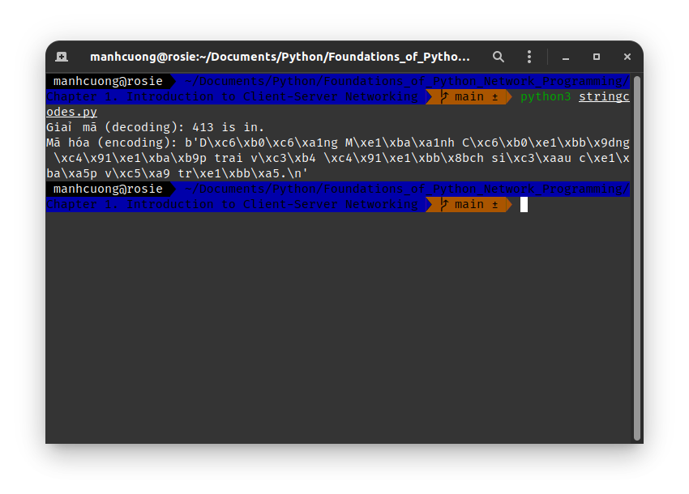

# 1. The Building Blocks: Stacks & Libraries
* Các khái niệm cần ghi nhớ:
  * **Protocol stack** _[ngăn xếp giao thức]_, trong đó **simpler network services** _[các dịch vụ mạng đơn giản]_ dc sử dụng làm nền tảng của các dịch vụ phức tạp hơn.

###### [search1.py](./search1.py)
* Cung cấp địa chỉ vào biến `address` sẽ cho biết vĩ độ - kinh độ của vị trí này.

# 2. Application Layers
##### [search2.py](./search2.py)
* Sử dụng package `requests` của Python để gọi API cung cấp tọa độ từ một vị trí `address`.

# 3. Speaking a Protocol
##### [search3.py](./search3.py)
* Sử dụng giao thức HTTP và gửi yêu cầu GET để lấy dữ liệu.

# 4. A Raw Network Conversation
##### [search4.py](./search4.py)
* Sử dụng **socket** để lấy dữ liệu.

# 5. Turtles All the Way Down
* Những điểm cần ghi nhớ:
  * **Protocol** _[giao thức]_: có nghĩa là xây dựng một cuộc trò chuyện cấp cao - phức tạp về ngữ nghĩa và cuối cùng là các chuỗi văn bảndc gửi qua lại giữa hai máy tính bằng cách sử dụng phần cứng mạng của chúng.
  * Một **protocol stack** cụ thể gồm **4 protocols high** _[4 giao thức cấp cao]_:
    * Trên cùng là API, thực hiện các truy vấn thông qua URL và lấy dữ liệu qua JSON trả về ([search1.py](./search1.py)).
    * Các URL dc đặt tên riêng cho các dữ liệu mà có thể thực hiện truy vấn để lấy dữ liệu về thông qua giao thức HTTP ([search2.py](./search2.py)).
    * HTTP hỗ trợ **document-oriented** _[định hướng tài liệu]_ bằng các lệnh như `GET` thông qua **TCP/IP sockets** ([search3.py](./search3.py)).
    * Gửi và nhận các **byte strings** _[chuỗi byte]_ thông qua **TCP/IP sockets**.
* Các lớp hoạt động của `socket()` API như sau:
  * **Transmission Control Protocal (TCP)** hỗ trợ các **two-way conversations** được tạo thành từ các **stream of byte** dc gọi là **package**.
  * **Internet Protocol (IP)** biết cách gửi các package giữa các máy tính khác nhau.

# 6. Encoding & Decoding _[Mã hóa & Giải mã]_
* Byte [0000.0000, 1111.1111] có giá trị thập phân từ [0, 255].

##### [stringcodes.py](./stringcodes.py)
* Demo mã hóa _(encoding)_ và giải mã _(decoding)_.
